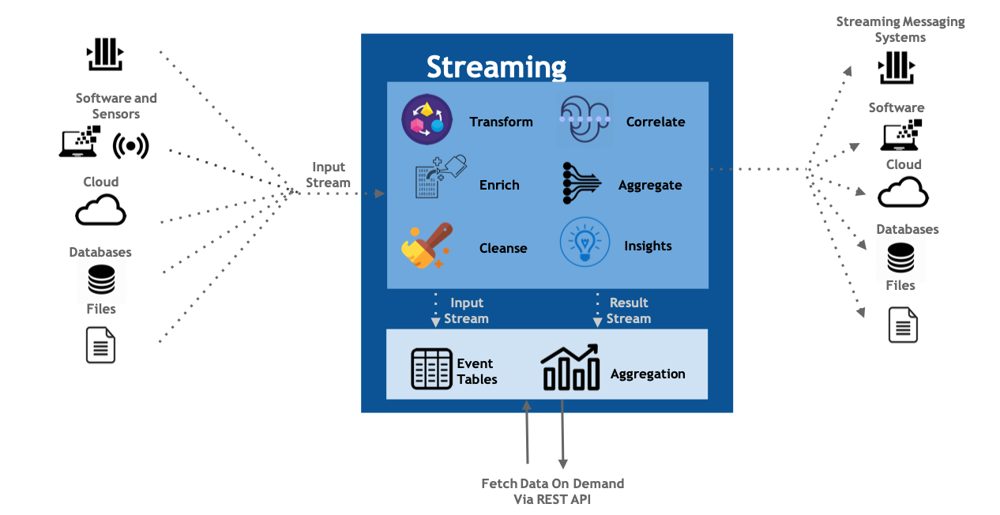

# WSO2 Streaming Integrator

[](https://opensource.org/licenses/Apache-2.0)
[](https://stackoverflow.com/questions/tagged/wso2-streaming-integrator)
[](https://discord.com/invite/wso2)
[](https://twitter.com/intent/follow?screen_name=wso2)

WSO2 Streaming Integrator (SI) is a streaming data processing server that allows you to integrate streaming data and take action based on streaming data.



WSO2 SI is powered by [Siddhi.io](https://siddhi.io/), a well-known cloud native open source stream processing engine. Siddhi lets users write complex stream processing logic using a SQL-like language known as [SiddhiQL](https://siddhi.io/en/v5.0/docs/).

To learn more about WSO2 Micro Integrator please visit [WSO2 Streaming Integrator](https://wso2.com/integrator/streaming-integrator/).

## Why Streaming Integrator? 

WSO2 SI can be effectively used for:
- Realtime ETL with files, DBs, SaaS apps, HTTP endpoints, etc.
- Working with streaming messaging systems such as Kafka and NATS
- Streaming data integration
- Executing complex integrations based on streaming data

 You can aggregate, transform, enrich, analyze, cleanse, and correlate streams of data on the fly using Siddhi queries and constructs.

[SI tooling](https://github.com/wso2/streaming-integrator-tooling) provides a web-based IDE that allows you to build Siddhi applications with a drag-and-drop graphical editor or a streaming SQL code editor.

SI has native support for Kubernetes with a [K8s Operator](https://siddhi.io/en/v5.1/docs/siddhi-as-a-kubernetes-microservice/) designed to provide a convenient way of deploying SI on K8s. 

## Get started

See the following topics to get started with the product:
- [System prerequisites](https://si.docs.wso2.com/setup/installing-si-in-vm/#system-requirements)
- [Quick start guide](https://si.docs.wso2.com/quick-start-guide/quick-start-guide/)

See the [tutorials](https://si.docs.wso2.com/examples/tutorials-overview/) to try out the main integration use cases.

## Contribute to Streaming Integrator

### Build from the source

To build the WSO2 Streaming Integrator from source, follow the steps below.

  1. Clone or download the source code from this repository.
  2. Run `mvn clean install` from the root directory of the repository.
  3. The generated Streaming Integrator distribution can be found at `streaming-integrator/modules/distribution/target/-streaming-integrator-<version>.zip`

When building with dependencies, you need to build in the following order.
  1. [siddhi](https://github.com/siddhi-io/siddhi)
  2. [carbon-analytics-common](https://github.com/wso2/carbon-analytics-common)
  3. [carbon-analytics](https://github.com/wso2/carbon-analytics)
  4. [carbon-dashboards](https://github.com/wso2/carbon-dashboards)
  5. [carbon-ui-server](https://github.com/wso2/carbon-ui-server)

## Deploy Streaming Integrator

### Deploy in Docker

WSO2 Streaming Integrator has a Docker distribution so that it can be deployed in any container-orchestration system.
The Docker image can be built from the source, or downloaded directly from Docker Hub.

#### Build the Docker image

Before building the docker image, install Docker on the host machine.

To build the Docker image from the source, issue the following command from the root directory.<br/>
`mvn clean install -Ddocker.skip=false`

#### Get the image from Docker Hub

To get the Docker image from Docker Hub, issue the following command.


```bash
docker pull wso2/wso2si
```

### Deploy in Kubernetes

WSO2 Streaming Integrator can be deployed in a Kubernetes cluster using Siddhi Operator. [Siddhi operator](https://github.com/siddhi-io/siddhi-operator) enables the deployment of Siddhi applications directly in your Kubernetes cluster using a Kubernetes Custom Resource.
For more details see [Installing Streaming Integrator Using Kubernetes](https://si.docs.wso2.com/setup/installing-si-using-kubernetes/).

## Report issues

### Open an issue

Help us make our software better! Submit any bug reports or feature requests through [WSO2 Streaming Integrator GitHub](https://github.com/wso2/product-streaming-integrator) repo.

### Report security issues

Please **do not** report security issues via GitHub issues. Instead, follow the [WSO2 Security Vulnerability Reporting Guidelines](https://security.docs.wso2.com/en/latest/security-reporting/vulnerability-reporting-guidelines/).

## Join the community!

- Read our [documentation](https://si.docs.wso2.com/en/latest/).
- Get help on [Stack Overflow](https://stackoverflow.com/questions/tagged/wso2-streaming-integrator).
- Join the conversation on [Discord](https://discord.gg/wso2).
- Learn more by reading articles from our [library](https://wso2.com/library).

## Get commercial support

You can take advantage of a WSO2 on-prem product subscription for the full range of software product benefits needed in your enterprise, like expert support, continuous product updates, vulnerability monitoring, and access to the licensed distribution for commercial use.

To learn more, check [WSO2 Subscription](https://wso2.com/subscription/).

## Can you fill out this survey?

WSO2 wants to learn more about our open source software (OSS) community and your communication preferences to serve you better.
In addition, we may reach out to a small number of respondents to ask additional questions and offer a small gift.

The survey is available at: [WSO2 Open Source Software Communication Survey
](https://forms.gle/h5q4M3K7vyXba3bK6)

--------------------------------------------------------------------------------
(c) Copyright 2012 - 2025 WSO2 Inc.
