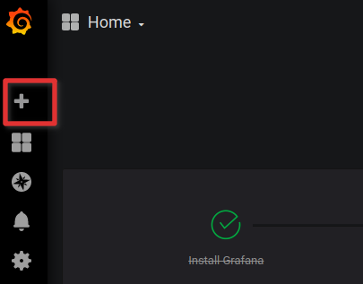

# How to add Dashboards to Grafana

In order to use these dashboards with grafana you have to follow these instructions

## 1. Start the grafana server.

i. Navigate to grafana directory.  
ii. Issue following command in the console `bin/grafana-server`.  
iii. Navigate to grafana home with following URL `localhost:3000`.

## 2. Load dashboards into grafana.
Once you have login to the grafana follow these steps to import dashboards into grafana

i. Navigate to +(plus) icon at the left upper corner.  

ii. Select `import`.  
iii. Then select `upload .json file` and select relevant json file from this directory.

